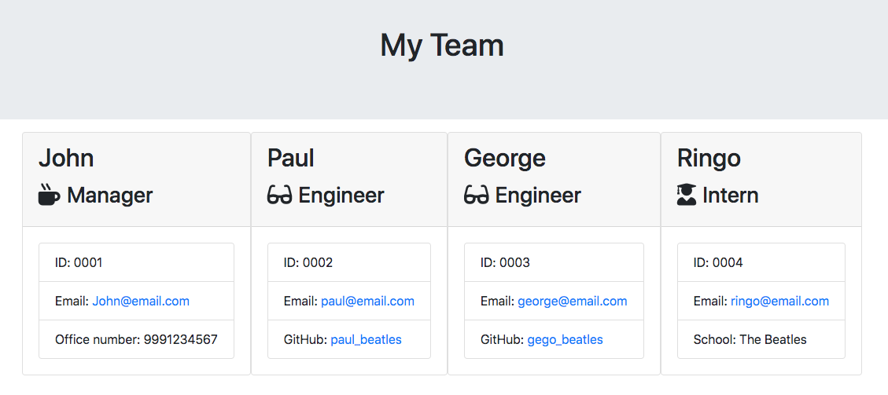

# Team Profile Generator
```
This is a Javascript file to generate an Team HTML page using NodeJs.
```

## Instructions

```
As a manager
I want to generate a webpage that displays my team's basic info
so that I have quick access to emails and GitHub profiles

Requiments:
NPM, Inquirer Node Module, Jest Node module, FS Node module.

1. Download or clone the files in this repo
2. Run app.js
3. Generated HTML file will be in OUTPUT folder
```

## Screenshot

